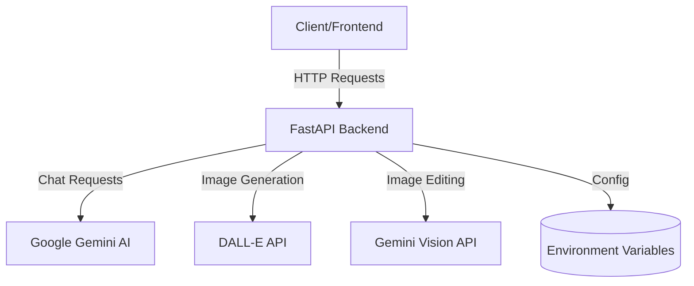
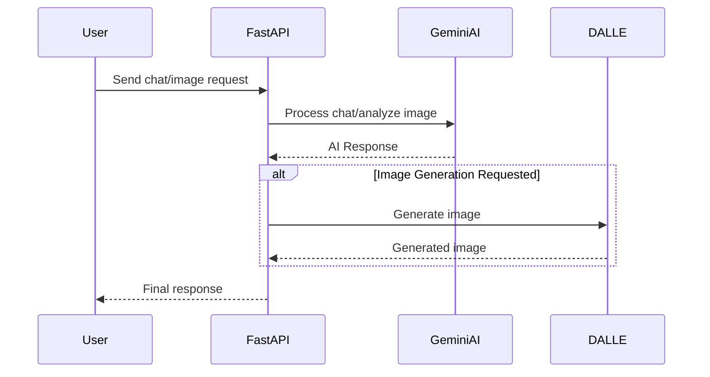

# Shatably AI System Design

## System Architecture Overview

## Core Components

### 1. API Layer (FastAPI)
- **Entry Points**:
  - `/chat/` - For AI interior design consultation
  - `/image/generate` - For generating interior design images
  - `/edit/` - For editing existing interior images

### 2. AI Services Integration
- **Google Gemini AI**
  - Primary chat interface
  - Image analysis capabilities
  - Image editing functionality
- **DALL-E**
  - Image generation from text descriptions

### 3. Data Flow

## Technical Architecture

### Backend Structure
- **FastAPI Application**
  - Modular router system
  - CORS middleware
  - Error handling middleware
  - Request validation

### API Endpoints Design
- **Chat Service**
  - Handles multimodal inputs (text + images)
  - Maintains conversation context
- **Image Service**
  - Processes image generation requests
  - Handles image format conversions
- **Edit Service**
  - Processes image editing requests
  - Handles image transformations

### Security & Configuration
- Environment-based configuration
- API key management
- CORS security
- Request validation

## Deployment Architecture

### Railway Deployment
- Docker containerization
- Environment variable management
- Automatic scaling capabilities
- Health monitoring

### Performance Considerations
- Asynchronous request handling
- Multiple worker processes
- Response caching where applicable
- Error handling and recovery

## Future Scalability

### Potential Improvements
1. **Caching Layer**
   - Redis integration for response caching
   - Session management

2. **Database Integration**
   - User history storage
   - Project persistence

3. **Load Balancing**
   - Multiple instance deployment
   - Geographic distribution

4. **Monitoring & Analytics**
   - Request tracking
   - Performance metrics
   - Error logging 
